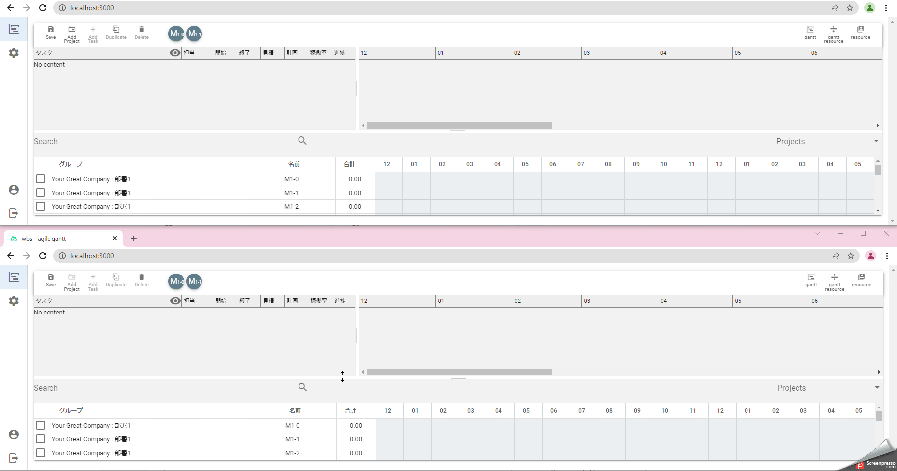

# agile-gantt

現役プレイングマネージャのぼくがかんがえたほぼさいきょうのガントチャートツールです。



アジャイル開発の台頭[^1]によって「柔軟」かつ「短期」の案件が同時多発的に発生[^2]するようになり、また、各案件で要求されるスキルも多様化しており、昔の様に１人月の仕事に１人を適当（？）にアサインするだけでは炎上してしまう案件が増えている様に感じます。

開発手法の変化に合わせて、管理手法も変化させなければ対応ができないはずだが、なぜだか[^3]ガントチャートやWBSのツールは進化しおらずDXの波から取り残されている様に思います。

タスク管理ツールとしては、[clickup](https://clickup.com/) や [Aasana](https://asana.com/) といった優秀なツールがあり愛用していますが、チケットベースの管理ツールは積み上げ型のツールであるため、プロジェクトの予算の概算や人員の割当をざっくり検討する用途では物足りなく感じています。

現状は、[taskline](http://mitsuyahiromi.sakura.ne.jp/fswiki/wiki.cgi?page=EXCEL%A5%DE%A5%AF%A5%ED%A4%C7%A5%AC%A5%F3%A5%C8%A5%C1%A5%E3%A1%BC%A5%C8%A4%F2%BA%EE%A4%C3%A4%C6%A4%DF%A4%BF)や、[ProjectLibre](https://ja.osdn.net/projects/sfnet_projectlibre/)などを使い続けたり、高額な[Microsoft Project](https://www.microsoft.com/ja-jp/microsoft-365/project/project-management-software)を横目で見ながらフリーのWebサービスを探すということをしていましたが、「パンがなければケーキを食べればいいじゃない」ということで、自分の管理で必要なものを自分で作ることにしました。

必ずしも最適解ではないかもしれませんが、そんなモチベーションで開発した [agile-gantt](https://github.com/kaku3/agile-gantt) のソースを公開したいと思います。
同じ様な業務を行っている方の助けになれば幸いです。


## 環境要件

```
node 16.13.2
yarn 1.22.4
```

## 実行

### フロントエンド

```
cd frontend
# インストール
yarn install
# 実行
yarn dev
```

http://localhost:3000 にアクセス

- release 版

```
# env.development.js をコピーして env.production.js を作成し適切に修正。
npm generate # 実行ファイルを dist/ に生成
npm start # サーバ実行
```


### バックエンド

```
cd backend
yarn install
node app.js
```

## コンセプト

- **「思ったとおり入力・編集できる」**
    - ツール作成のモチベーション
- 必要な機能からつくる
    - 工数見合いで優先順位をつける
    - 設定画面などは適当。動けばいい。ユーザーがついたら改善する
    - モチベーション維持のため技術的に面白そうなことの優先順位が上がることがある
- とりあえずDBは使わない
    - 導入しやすくするため、環境は最低限に抑える
    - そのうちバックエンドはまるっと差し替えできるように実装
        - お金があれば firebase を使いたい
- ソースコードが学習サンプルになること
    - Nuxt.js
        - store
        - auth
    - vuetify
    - express
        - socket.io


## ゴール

WBSが更新されない最大の理由は「めんどうくさい上にメリットが分かりにくいから」だと思います。可能な限りめんどうくさいを取り除いて適切にWBSが更新される状況を作り出して、プロジェクトが見える化されるメリットを共有できる状態をつくることです。

- 入力が簡単
    - リスケが容易にできるドラッグ＆ドロップ
    - プロジェクトテンプレートで抜け漏れをなくす
    - プロジェクトコピペで類似プロジェクト管理を容易に
- リソースの人月管理
    - 稼働率
    - 工数自動計算
    - 割当状況確認
- ざっくり進捗把握
    - 警告表示
- 一括管理
    - 多人数同時更新対応
        - 個人個人で別々のフォーマットでWBS管理を回避


## 要素技術

- フロントエンド
    - [Nuxt.js](https://nuxtjs.org/)
    フロントエンドフレームワーク。認証やaxiosなど結局細かく足さないとなので vue-cli で作り始めるより楽。
    - [Vuetify](https://vuetifyjs.com/)
    UIフレームワーク。element-ui よりモダン。
    - [splitpanes](https://www.npmjs.com/package/splitpanes)
    スプリッタ
    - [vue-nestable](https://www.npmjs.com/package/vue-nestable)
    タスク部階層つきドラッグ＆ドロップ。VueDraggable(Sortable.jsベース)も試したがこちらを採用。
    - [vue-draggable-resizable](https://www.npmjs.com/package/vue-draggable-resizable)
    タイムライン部ドラッグ＆ドロップ。vue-drag-resize も試したがこちらを採用。
    - [socket.io-client](https://www.npmjs.com/package/socket.io-client)
    Webリアルタイム通信（クライアント側）。
    サンプルコードとして読める様に、jsonをざっくり投げる簡単な実装にとどめた。
    - [excel-formula](https://www.npmjs.com/package/excel-formula)
    node 用 EXCEL関数。NETWORKDAYS が最高に便利。
    - [vue-json-to-csv](https://www.npmjs.com/package/vue-json-to-csv)
    jsonデータを csvファイルダウンロード

- バックエンド
    - [express](https://www.npmjs.com/package/express)
    Webサーバ
    - [socket.io](https://www.npmjs.com/package/socket.io)
    Webリアルタイム通信（サーバ側）
    サンプルコードとして読める様に、jsonをざっくり投げる簡単な実装にとどめた。
    - [jsonwebtoken](https://www.npmjs.com/package/jsonwebtoken)
    jwttoken エンコード/デコード
    - [bcrypt](https://www.npmjs.com/package/bcrypt)
    パスワードハッシュ

[^1]: 実際は、景気の低迷に伴いIT投資への予算が削減されたことで「低予算短納期」の案件が増え、それに対する対応が求められているという方が正確だと思うが、働き方改革とかDXとかアジャイルとか表現した方がポジティブでよいと思う。

[^2]: 今にはじまったことではない。予算が半分や1/3になればやり方を変えなければ対応できないと多くの人が感じることができるが、5%や10%カットを繰り返して徐々に下がっているため、なかなかやり方を変える機会がない。

[^3]: マネジメント層がITに疎く、変化を好まない。またプレイヤー層に比べてマネジメント層は母数も少ないため需要も少ない。